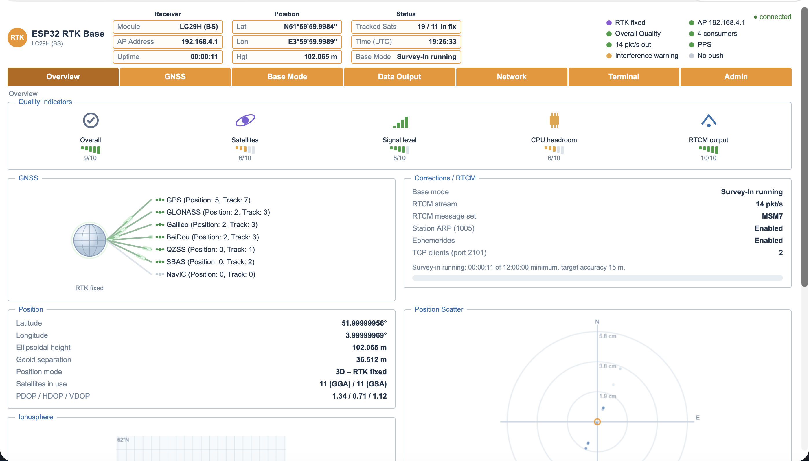
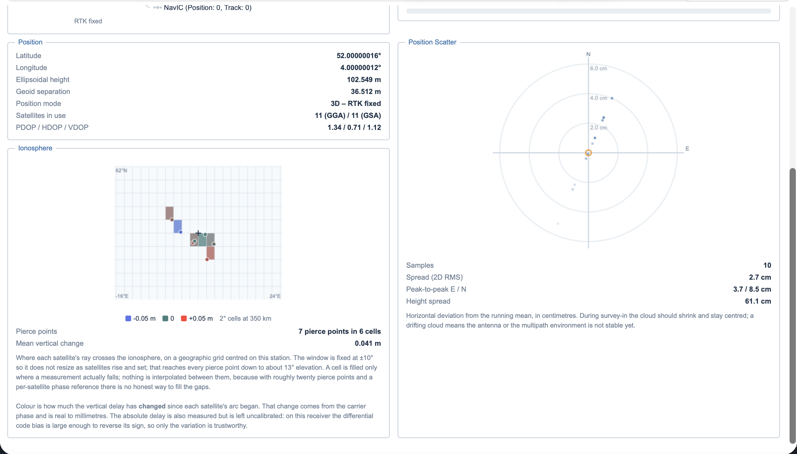
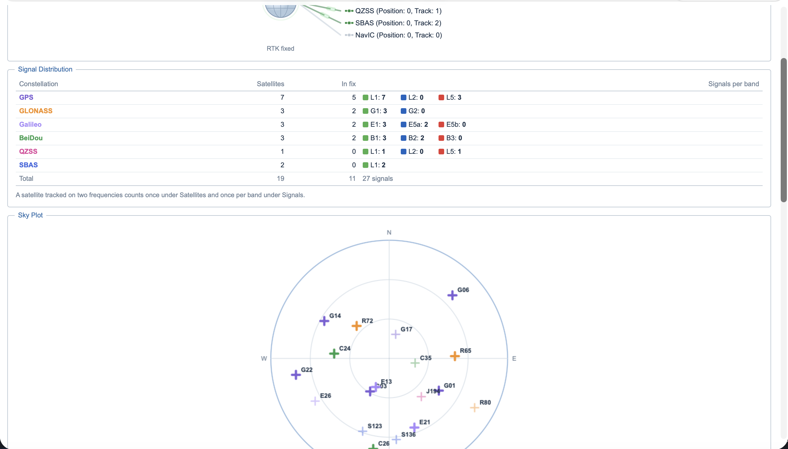
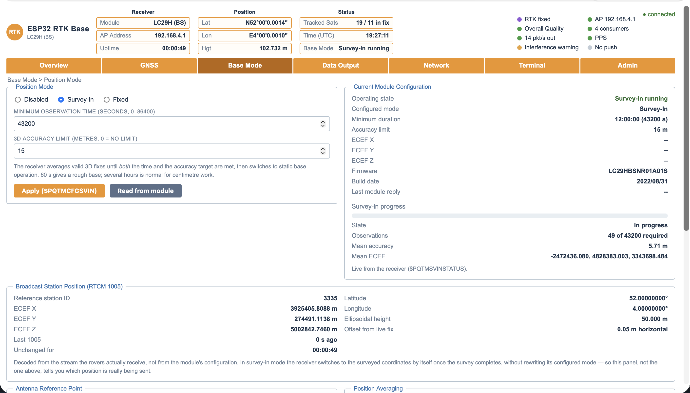
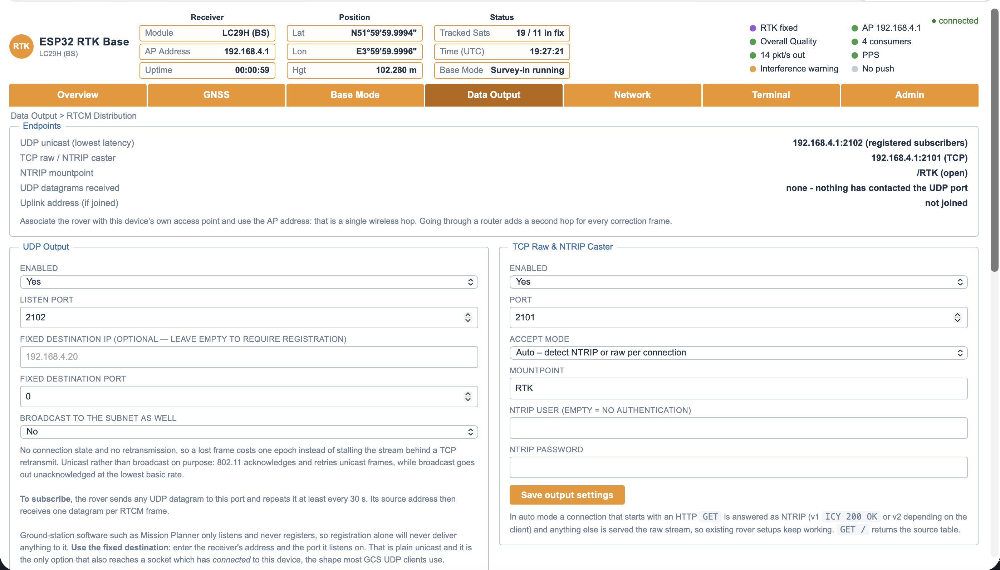
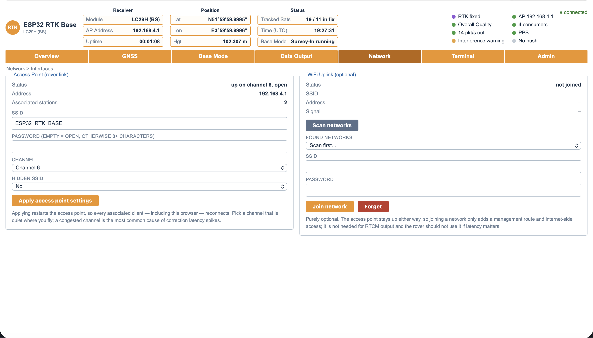

<h1>ESP32-RTK-BASE</h1>


ESP32-based RTK (Real-Time Kinematic) base station for GNSS correction data streaming over TCP, NTRIP and UDP.

<h2>Overview</h2>
This project turns an ESP32 into a networked RTK base station. It receives RTCM3 and NMEA from a multi-constellation GNSS receiver, reassembles and CRC-checks every correction frame, and serves it to rovers four different ways at once: a raw TCP stream, an NTRIP caster, UDP, and an outbound push to a remote caster. A seven-page web interface provides live telemetry over WebSocket — position, fix quality, sky view, signal distribution, interference status, survey-in progress and an ionospheric monitor — and the device runs its own access point so the rover never has to go through a router.



<h2>Features</h2>
<h3>Validated RTCM3 forwarding</h3>  Frames are reassembled and CRC-24Q checked before they leave the device. NMEA is stripped out, so the radio link carries corrections only.
<h3>NTRIP caster</h3>  NTRIP v1 (<code>ICY 200 OK</code>) and v2 on the same port as the raw stream, auto-detected per connection, with a source table and optional Basic authentication.
<h3>UDP output</h3>  Fixed destination, subnet broadcast or client registration. One datagram per RTCM frame, so a lost packet costs one epoch instead of stalling the stream behind a TCP retransmit.
<h3>NTRIP push</h3>  The base connects outbound to a caster such as RTK2go and uploads with the v1 <code>SOURCE</code> handshake, with backoff on failure.
<h3>Survey-In and Fixed base modes</h3>  Configured from the web page, with live progress, observation count and mean accuracy read from the receiver itself.
<h3>Broadcast position readback</h3>  RTCM 1005 is decoded back out of the outgoing stream, so the interface shows the coordinate that is really being sent rather than the one that was configured.
<h3>Antenna reference point offset</h3>  Marker-to-ARP North/East/Up offset applied to manually entered coordinates.
<h3>Multi-constellation tracking</h3>  GPS, GLONASS, Galileo, BeiDou, QZSS, SBAS and NavIC, with satellites and signals counted separately and satellites in the position solution parsed from GSA.
<h3>Interference monitor</h3>  L1 and L5 spectrum status from the receiver's own jamming detection.
<h3>Ionospheric monitor</h3>  MSM7 decoded on the device; carrier-derived ionospheric delay change per satellite, plotted on a geographic pierce-point grid.
<h3>Access point first networking</h3>  The soft-AP is always up as the rover's single-hop data path; joining a WiFi network is optional and only adds a management route.
<h3>Dual-core task architecture</h3>  Core 1 is reserved for the correction path; core 0 runs networking, telemetry and the web server.

<h2>Hardware Requirements</h2>
<h3>ESP32 Dev Board</h3>
Any dual-core ESP32. Tested on ESP32-WROOM-32D / DOIT DevKit v1.
<h3>GNSS Module</h3>
Waveshare Quectel LC29H (BS), or another RTK-capable receiver with NMEA and RTCM3 output. Tested against firmware <code>LC29HBSNR11A01S</code>.

<h2>Wiring / Circuit Setup</h2>


Handled by the user. Key connections:
<h3>GNSS TX => ESP32 GPIO17 (UART2 RX)</h3>
<h3>GNSS RX <= ESP32 GPIO16 (UART2 TX)</h3>
<h3>GNSS PPS => ESP32 GPIO27</h3>

The antenna needs a clear sky view and a rigid mount. A base whose antenna moves is worse than no base at all.

<h2>Installation</h2>

Built with [PlatformIO](https://platformio.org/).

```bash
git clone https://github.com/aryesil/RTK-BASE-ESP32
cd RTK-BASE-ESP32
pio run -t upload
```

Dependencies are resolved automatically: `ArduinoJson`, `ESPAsyncWebServer`, `AsyncTCP`, `TinyGPSPlus`.

`platformio.ini` pins the AsyncTCP task to core 0, so HTTP and WebSocket work can never land on the core that forwards corrections:

```ini
build_flags =
    -D CONFIG_ASYNC_TCP_RUNNING_CORE=0
```

OTA updates are available; the device advertises itself as `ESP32-RTK-BASE` and OTA is serviced in every network state.

<h2>First Run</h2>

1) Power the device. It starts an open access point named **ESP32_RTK_BASE** on channel 6.
2) Connect to it and open **http://192.168.4.1**.
3) On the **Network** tab, set an access point password and pick a quiet channel. Optionally join your own WiFi as an uplink — the access point stays up either way.
4) On the **Base Mode** tab, choose Survey-In or Fixed.
5) Point the rover at one of the endpoints listed on the **Data Output** tab.

There is no separate WiFi setup page; the full interface is served from the first boot.

<h2>Web Interface</h2>

Seven tabs, served entirely from flash with no CDN and no internet access required.

<h3>Overview</h3>

Quality indicators, the constellation fan with a live downlink animation, correction status, position, the ionospheric monitor and a position scatter plot.



The position scatter shows horizontal deviation from the running mean in centimetres. During survey-in the cloud should shrink and stay centred; a drifting cloud means the antenna or the multipath environment is not stable yet. A red cross marks the coordinate actually being broadcast in RTCM 1005, so a station coordinate that is simply wrong shows up here rather than hiding behind a self-centred plot.

<h3>GNSS</h3>



The Signal Distribution table separates two things that are easy to confuse: a satellite tracked on two frequencies counts **once** under Satellites and **once per band** under Signals. The sky plot draws one marker per satellite, filled when that satellite is used in the position solution.


Carrier-to-noise per band, and C/N0 against elevation — the standard way to spot a bad antenna, an obstruction or multipath.

<h3>Base Mode</h3>



<h3>Data Output</h3>



<h3>Network</h3>



<h3>Terminal</h3>

A serial terminal to the module. Commands starting with `$` get an NMEA checksum appended automatically. Periodic status messages are hidden by default so command replies stay readable; a checkbox brings them back.

<h3>Admin</h3>

Module and firmware versions, uptime, free heap, CPU load per core, PPS status and reboot.

<h2>Data Output</h2>

| Transport | Port | Notes |
| --- | --- | --- |
| Raw TCP | 2101 | connect and listen, nothing to send |
| NTRIP caster | 2101 | same port, auto-detected per connection |
| UDP | 2102 | fixed destination, broadcast or registration |
| NTRIP push | outbound | this base uploads to a remote caster |

<h3>NTRIP caster</h3>

A connection beginning with an HTTP `GET` is answered as NTRIP; anything else is served the raw stream, so existing rover setups keep working unchanged. `GET /` returns the source table.

```text
NTRIP URL:  http://192.168.4.1:2101/RTK
Raw TCP:    192.168.4.1 port 2101
```

<h3>UDP</h3>

Three ways to receive it:

- **Fixed destination** — enter the receiver's address and listen port. Plain unicast, and the only option that also reaches a socket which has *connected* to this device.
- **Broadcast** — reaches anything bound to the listen port with no configuration, but only if that socket is left unconnected. It goes out unacknowledged at the lowest WiFi rate, so prefer the fixed destination when you know the address.
- **Registration** — the rover sends any datagram to the port and repeats it every 30 s; its source address then receives the stream.

> **Mission Planner:** use **UDP Host** (not UDP Client) on port 2102 with broadcast enabled, or give the fixed destination its address and listen port. A UDP client socket calls `connect()`, and a connected UDP socket does not accept broadcast datagrams — that is standard socket behaviour, not a quirk of this firmware.

<h3>NTRIP push</h3>

Needs a WiFi uplink; the access point alone has no route off the device. Reconnection backs off from 5 s to 60 s so a wrong mountpoint does not hammer someone else's server.

<h2>Base Station Setup</h2>

<h3>Survey-In</h3>
The receiver averages valid 3D fixes until both the minimum duration and the 3D accuracy target are met, then switches to static base operation. Progress, observation count and mean accuracy are read live from `$PQTMSVINSTATUS`.

Note that the module switches to the surveyed coordinates by itself when the survey completes, but leaves its **configured** mode at survey-in. The interface therefore shows *operating state* separately from *configured mode*, and decodes RTCM 1005 out of the outgoing stream to show which coordinate is really being broadcast. When the survey finishes, one button promotes its result into fixed mode.

A few hours of survey-in gives roughly decimetre absolute accuracy. For centimetre work, log raw data, post-process it, and enter the result in Fixed mode.

<h3>Fixed</h3>
Enter the station position as ECEF X/Y/Z or as latitude/longitude/ellipsoidal height, which the device converts.

<h3>Antenna Reference Point</h3>
RTCM 1005 broadcasts the antenna reference point. If you enter the coordinates of a surveyed ground mark, set the marker-to-ARP offset — usually just the antenna height — or every rover position will be off by that amount. Leave it at zero when the coordinates already refer to the antenna, as they do for a survey-in result.

<h2>Ionosphere Monitor</h2>

The Overview panel shows where each satellite's ray crosses the ionosphere, on a fixed ±10° geographic grid centred on the station, coloured by how much the vertical delay has **changed** since that satellite's arc began. It is built from the dual-frequency observations the module already broadcasts: MSM7 is decoded on the device and the geometry-free combination gives an ionospheric delay per satellite. The LC29H tracks GPS L1+L5, Galileo E1+E5a and BeiDou B1I+B2a, which yields roughly twenty usable arcs.

Read the limits before trusting it:

- The **change** is real. It comes from the carrier phase, is precise to millimetres, and the hardware biases cancel in a difference. Cycle slips are caught using the receiver's own lock-time and half-cycle indicators rather than a magnitude threshold.
- The **absolute** delay is measured but left uncalibrated. On this receiver the differential code bias is large enough to reverse its sign, so it is shown for reference only.
- **Nothing is interpolated.** A cell is filled only where a measurement actually falls. With roughly twenty pierce points and a per-satellite phase reference there is no honest way to fill the gaps.

This is not the SBAS ionosphere grid found on survey-grade receivers. That grid is decoded from EGNOS messages already calibrated by a network of ground stations; the LC29H (BS) does not output raw SBAS data, so it cannot be reproduced here.

<h2>GNSS Module Configuration</h2>
The following commands are sent during boot via Serial2 (UART):

### Check firmware version

```text
$PQTMVERNO*
```

### Enable RTCM output

```text
$PAIR432,1*    # Enable MSM7 observations (1077/1087/1097/1117/1127)
$PAIR434,1*    # Enable RTCM 1005 ARP message
$PAIR436,1*    # Enable RTCM ephemeris messages
```

RTCM settings are stored on the ESP32 and re-applied at boot, so they follow whatever you selected on the Data Output page.

### Enable NMEA output messages
```text
$PAIR062,0,1*    # GGA - Time, position and fix information
$PAIR062,1,1*    # GLL - Geographic position
$PAIR062,2,1*    # GSA - DOP and active satellites
$PAIR062,3,1*    # GSV - Satellites in view
$PAIR062,4,1*    # RMC - Recommended minimum navigation data
$PAIR062,6,1*    # ZDA - UTC date and time
$PAIR062,7,1*    # GRS - Range residuals
$PAIR062,8,1*    # GST - Position error statistics
```

### Optional messages

These come from the wider LC29H series specification rather than the (BS) document, so they are probed at boot and the interface falls back silently if the firmware does not answer. Both were confirmed working on `LC29HBSNR11A01S`.

```text
$PQTMCFGMSGRATE,W,PQTMSVINSTATUS,1,1*    # live survey-in progress
$PAIR391,1*                              # interference detection ($PAIRSPF / $PAIRSPF5)
```

### Survey-In and Fixed

Set from the Base Mode page rather than hardcoded, so a reboot never silently restarts a survey:

```text
$PQTMCFGSVIN,W,1,<minDuration>,<accuracyLimit>,0,0,0*    # Survey-In
$PQTMCFGSVIN,W,2,0,0,<ecefX>,<ecefY>,<ecefZ>*            # Fixed
$PQTMCFGSVIN,R*                                          # Read back
$PQTMSAVEPAR*                                            # Persist to module NVM
```

These are designed for the Quectel LC29H(BS) module. If your GNSS receiver uses a different command set, edit `applyGnssConfiguration()` in `src/gnss/GNSS_Core.cpp` and the builders in `src/gnss/BaseConfig.cpp`.

<h2>Pin Assignments</h2> (hardcoded in include/Config.h)

| Constant    | Value    | Purpose                             |
| ----------- | -------- | ----------------------------------- |
| `RXD2`      | `17`     | GNSS TX → ESP32 UART2 RX            |
| `TXD2`      | `16`     | ESP32 UART2 TX → GNSS RX            |
| `GNSS_BAUD` | `115200` | Serial2 baud rate                   |
| `PPS_PIN`   | `27`     | PPS interrupt input                 |
| `RTCM_PORT` | `2101`   | TCP listening port, raw and NTRIP   |
| `UDP_PORT`  | `2102`   | UDP listening port                  |

<h2>Other Defaults</h2>
<h3>Access point:</h3> ESP32_RTK_BASE, open, channel 6 (configurable at runtime)
<h3>Max TCP/NTRIP consumers:</h3> 6 (MAX_TCP_CLIENTS in Config.h)
<h3>Max UDP subscribers:</h3> 6 (MAX_UDP_CLIENTS in Config.h)
<h3>Max tracked signals:</h3> 120 (MAX_SIGNALS in Config.h)
<h3>NMEA buffer size:</h3> 256 chars (MAX_NMEA in Config.h)
<h3>Serial2 RX buffer:</h3> 2048 bytes (set at runtime in setupGNSS())
<h3>Ionospheric shell height:</h3> 350 km (IONO_SHELL_KM in Config.h)

<h2>Testing Without Hardware</h2>

`tools/mock_ui.py` runs the entire web interface on a PC. It extracts the page from `src/web/WebUI.h`, serves it, and fakes the device behind it: a WebSocket pushing synthetic telemetry once a second plus all the `/api/*` endpoints, so every page and form can be exercised end to end. Standard library only, no dependencies.

```bash
python3 tools/mock_ui.py                     # http://localhost:8080
python3 tools/mock_ui.py --scenario fixed    # survey | fixed | nofix | cold
```

The screenshots in this README were taken from it. Restart the script after editing the page — it is read once at startup.

<h2>Architecture</h2>

```text
CORE 1 (loopTask)                          CORE 0 (NetworkTask, 20 ms)
 UART read, 256 B at a time                 WiFi state machine, OTA
 RTCM 3 reassembly + CRC-24Q                NTRIP push state machine
 RTCM 1005 / MSM7 decode                    telemetry JSON at 1 Hz
 fan-out: TCP, NTRIP, UDP                   WebSocket queue drain
 NMEA parse: GGA, GSA, GSV                  AsyncTCP (HTTP / WS)
```

Core 1 is reserved for the correction path. Client housekeeping — accepting connections, NTRIP handshakes, UDP registration — is polled at 20 ms rather than every loop iteration, because each of those calls is an lwIP socket operation and at 1 ms they consumed thousands of syscalls a second on the core that has to stay deterministic. The RTCM send path itself is never throttled.

Shared state is guarded by three mutexes: `dataMutex` for the satellite and position snapshot, `tcpMutex` for the output sockets, `baseMutex` for the module configuration mirror. Sentence parsers write to staging variables owned by core 1 and publish under lock, so no lock is taken inside the byte loop.

Measured on an ESP32-WROOM-32D tracking 39 satellites: **2 % load on each core**, 21 % of RAM, 78 % of the 1.25 MB application partition, 11 RTCM frames per second at about 1.1 kB/s with zero CRC errors.

<h2>Project Structure</h2>

````markdown
├── platformio.ini              # Build configuration (env: esp32-dev)
├── include/
│   ├── Config.h                # Pin definitions, baud rate, ports, limits
│   └── Globals.h               # Global state, structs and FreeRTOS handles
├── src/
│   ├── Globals.cpp             # Global variable instantiations
│   ├── core/
│   │   └── main.cpp            # setup()/loop(), task creation and CPU pinning
│   ├── gnss/
│   │   ├── GNSS_Core.cpp       # Satellite classification, NMEA helpers, module config
│   │   ├── GNSS_Processor.cpp  # Serial loop, RTCM framing and CRC, sentence dispatch
│   │   ├── BaseConfig.cpp      # Survey-in / fixed, ARP offset, position averaging
│   │   └── Iono.cpp            # MSM7 decode and ionospheric monitor
│   ├── network/
│   │   ├── NetworkManager.cpp  # Access point, optional station uplink, OTA
│   │   ├── DataOutput.cpp      # TCP raw, NTRIP caster, UDP fan-out
│   │   └── NtripPush.cpp       # Outbound NTRIP server to a remote caster
│   ├── system/
│   │   └── SystemManager.cpp   # UART setup, semaphores, queues, PPS ISR
│   └── web/
│       ├── WebServerManager.cpp# HTTP routes, API endpoints, telemetry JSON
│       └── WebUI.h             # The entire interface, served from flash
├── tools/
│   └── mock_ui.py              # Run the interface without hardware
└── docs/img/                   # Interface screenshots

````

<h2>Known Limitations</h2>

<h3>No authentication on the web interface</h3>  Anyone on the network can reach the configuration pages and the serial terminal. Set an access point password and treat the AP as the trust boundary.
<h3>Open access point by default</h3>  Change it on the Network tab before deploying anywhere real.
<h3>Survey-in is not a survey</h3>  Decimetre absolute accuracy at best. Post-process for centimetre work.
<h3>GLONASS is single-frequency</h3>  On this module it contributes no ionospheric measurements.
<h3>Consumer limits</h3>  Six simultaneous TCP/NTRIP consumers and six UDP subscribers; beyond that the caster answers `503`.

<h2>Acknowledgements</h2>

Parts of the interface layout were inspired by conventions used in Septentrio
receiver web interfaces.

## License

This project is licensed under the MIT License.
See `LICENSE` for details.
